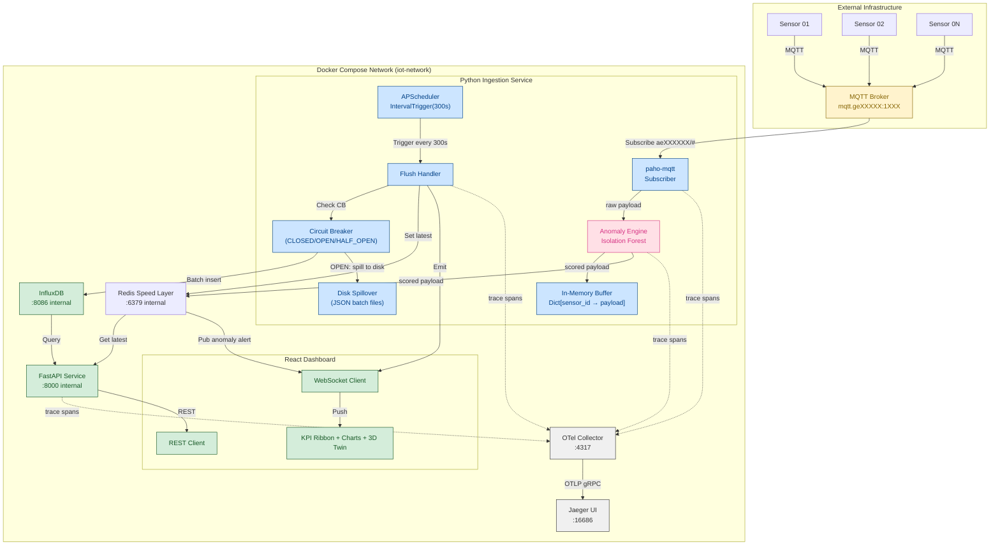

# IoT Telemetry Pipeline & Analytical Dashboard — High-Level Design

**Version:** 1.0
**Date:** 2026-05-04
**Status:** Draft

---

## 1. System Architecture Overview

The system consists of four primary layers:

```
[ Sensors (Physical) ]
        |
        v (MQTT over TCP)
[ External MQTT Broker: mqtt.geXXXXX:1XXX ]
        |
        v (Subscribe)
[ Python Ingestion Service (paho-mqtt + APScheduler) ]
        |  (in-memory buffer, flush every 300s)
        v (batch write)
[ Time-Series Database (InfluxDB / TimescaleDB) ]
        |
        v (query)
[ FastAPI Backend (REST + WebSocket) ]
        |
        v (HTTP / WS)
[ React Dashboard (Vite + Tailwind CSS) ]
```

### Data Flow Summary

1. **Sensors** publish telemetry data to the external MQTT broker on topic `aeXXXXXX/<sensor_id>/<reading_type>`
2. **Python Ingestion Service** subscribes to `aeXXXXXX/#`, buffers the latest payload per sensor_id in memory
3. **APScheduler** triggers a flush every 300 seconds, writing all buffered readings to the **time-series database** in a single batch operation
4. **FastAPI** queries the database and exposes REST endpoints; also pushes live data via WebSocket on each flush completion
5. **React Dashboard** consumes REST and WebSocket data, rendering KPIs and charts in the browser

---

## 2. Data Flow Diagram



---

## 3. Docker Compose Architecture

### Network

- Network name: `iot-network`
- Driver: `bridge`
- Internal DNS resolution via service names

### Services, Ports, and Volumes

| Service | Image | Internal Port | External Port | Volumes | Depends-On |
|---------|-------|---------------|---------------|----------|-------------|
| `influxdb` | `influxdb:2.7` | `:8086` | — | `influxdb-data:/var/lib/influxdb2` | — |
| `redis` | `redis:7-alpine` | `:6379` | — | `redis-data:/data` | — |
| `api` | (Python FastAPI, built locally) | `:8000` | `:3000` | `none` | `influxdb`, `redis` |
| `ingestion` | (Python, built locally) | `:8001` (health) | — | `./models:/models:ro` | `influxdb`, `redis` |
| `frontend` | (React Vite, built locally) | `:5173` | `:8080` | `none` | `api` |
| `otel-collector` | `otel/opentelemetry-collector-contrib:0.96.0` | `:4317`, `:4318` | — | `./config/otel-collector.yaml:/etc/otelcol-contrib/config.yaml` | — |
| `jaeger` | `jaegertracing/all-in-one:1.54` | `:16686`, `:14250` | `:16686` | `none` | `otel-collector` |

### Network Configuration

```yaml
networks:
  iot-network:
    driver: bridge

services:
  influxdb:
    image: influxdb:2.7
    volumes:
      - influxdb-data:/var/lib/influxdb2
    networks:
      - iot-network
    environment:
      INFLUXDB_TOKEN: "${INFLUXDB_TOKEN}"
    healthcheck:
      test: ["CMD", "influx", "ping"]
      interval: 10s
      timeout: 5s

  redis:
    image: redis:7-alpine
    volumes:
      - redis-data:/data
    networks:
      - iot-network
    command: redis-server --appendonly yes
    healthcheck:
      test: ["CMD", "redis-cli", "ping"]
      interval: 10s
      timeout: 5s

  ingestion:
    build:
      context: ./services/ingestion
    networks:
      - iot-network
    depends_on:
      influxdb:
        condition: service_healthy
      redis:
        condition: service_healthy
    volumes:
      - ./models:/models:ro  # Mount trained Isolation Forest model (read-only)
    environment:
      MQTT_BROKER: "mqtt.geXXXXX"
      MQTT_PORT: "1XXX"
      MQTT_TOPIC: "aeXXXXXX/#"
      INFLUXDB_URL: "http://influxdb:8086"
      REDIS_URL: "redis://redis:6379"
      FLUSH_INTERVAL_SECONDS: "300"
      ANOMALY_MODEL_PATH: "/models/iforest.joblib"
      ANOMALY_THRESHOLD: "-0.5"
      OTEL_EXPORTER_ENDPOINT: "http://otel-collector:4317"
    healthcheck:
      test: ["CMD", "curl", "-f", "http://localhost:8001/health"]
      interval: 30s

  api:
    build:
      context: ./services/api
    ports:
      - "3000:8000"
    networks:
      - iot-network
    depends_on:
      - influxdb
      - redis
    environment:
      INFLUXDB_URL: "http://influxdb:8086"
      INFLUXDB_ORG: "iot-project"
      INFLUXDB_BUCKET: "sensor-data"
      INFLUXDB_TOKEN: "${INFLUXDB_TOKEN}"
      REDIS_URL: "redis://redis:6379"
    healthcheck:
      test: ["CMD", "curl", "-f", "http://localhost:8000/health"]
      interval: 30s
      timeout: 5s

  frontend:
    build:
      context: ./frontend
    ports:
      - "8080:5173"
    networks:
      - iot-network
    depends_on:
      - api

  otel-collector:
    image: otel/opentelemetry-collector-contrib:0.96.0
    volumes:
      - ./config/otel-collector.yaml:/etc/otelcol-contrib/config.yaml
    networks:
      - iot-network
    ports:
      - "4317:4317"   # OTLP gRPC receiver
      - "4318:4318"   # OTLP HTTP receiver

  jaeger:
    image: jaegertracing/all-in-one:1.54
    networks:
      - iot-network
    ports:
      - "16686:16686"  # Jaeger UI
      - "14250:14250"  # gRPC from collector
```

### Volume Configuration

```yaml
volumes:
  influxdb-data:
    driver: local
    driver_opts:
      type: none
      o: bind
      device: "D:\\Docker\\Volumes\\influxdb-data"
  redis-data:
```

---

## 4. Technology Stack Justification

### MQTT Broker: External (Eclipse Mosquitto-compatible)

An external MQTT broker is assumed pre-existing. The ingestion service uses **paho-mqtt** for Python-native MQTT subscription with callback-based message handling.

**Why paho-mqtt:** Mature, battle-tested, async-capable, minimal footprint. Alternative (mqtt.js) would require Node.js runtime unnecessarily.

### Ingestion Service: Python

Python is the right choice for:
- Rapid development against the MQTT SDK (paho-mqtt)
- APScheduler integration for cron-like scheduling is first-class in Python
- Lightweight service — GIL is not a bottleneck given the 5-minute flush cadence
- Strong ecosystem for time-series database clients (influxdb-client-python)

### Time-Series Database: InfluxDB 2.7

InfluxDB is purpose-built for high-write time-series workloads:
- Native `timestamp` indexing and time-range queries
- Built-in downsampling and retention policies
- Flux and InfluxQL query languages
- Single-binary deployment (no external dependencies like TimescaleDB's PostgreSQL requirement)

**Alternative considered:** TimescaleDB — requires PostgreSQL as base, adds operational complexity; InfluxDB is purpose-built and lighter-weight for this use case.

### Backend API: Python FastAPI

FastAPI delivers:
- Async request handling (critical for WebSocket connections)
- Auto-generated OpenAPI documentation
- Pydantic validation on all inputs/outputs
- Uvicorn ASGI server for production deployment

### Frontend: React + Tailwind CSS (Vite)

- **Vite** for sub-second hot module replacement and fast production builds
- **Tailwind CSS** for utility-first styling — no separate CSS files, consistent design system
- **Recharts** or **ApexCharts** for time-series visualization (lightweight, React-native)
- **React Three Fiber** (`@react-three/fiber`) for declarative 3D Digital Twin scene rendering
- **@react-three/drei** for camera controls, HTML overlays, and environment maps
- **@react-three/postprocessing** for bloom/glow effects on critical sensor nodes
- WebSocket consumption via native browser WebSocket API or a lightweight hook wrapper
- The 3D scene consumes the same WebSocket data path as the 2D charts — no additional backend changes required

---

## 5. Key Architectural Decisions

### Decision 1: Server-Side 5-Minute Buffering (not client-side batching)

Sensors are assumed to publish continuously with no ability to modify firmware to batch. Therefore the server buffers the latest reading per sensor in memory and flushes every 5 minutes. This is the core invariant of the system.

### Decision 2: In-Memory Buffer Discards All But Latest Per Sensor

Given the 5-minute flush cadence, older readings within the same interval carry no additional information. Storing only the latest per sensor keeps memory bounded regardless of MQTT message frequency.

### Decision 3: WebSocket Push on Flush Completion (not per MQTT message)

The WebSocket pushes to clients **after each database flush** (every 5 minutes), not on every MQTT message. This prevents client flooding and ensures clients see consistent, persisted data rather than transient buffered values.

### Decision 4: FastAPI is Stateless

FastAPI holds no in-memory state — all sensor data lives in InfluxDB. This enables horizontal scaling if needed. WebSocket connections are managed via connection tracking but do not hold database state.

### Decision 5: Inline Anomaly Detection (not a Separate Service)

The anomaly detection model runs **in-process** within the Python ingestion service rather than as a separate microservice. Rationale:
- Inference latency <2ms eliminates the need for async scoring
- No network hop, no serialization overhead, no additional container
- Failure is non-blocking: a try/except wraps scoring so a model error never prevents data ingestion
- Model is loaded once at startup from a `joblib` file (~50KB) mounted as a Docker volume
- Model retraining happens offline; updated model files are hot-reloaded via file-watcher

### Decision 6: Circuit Breaker Pattern for InfluxDB Writes

A three-state Circuit Breaker (CLOSED / OPEN / HALF_OPEN) protects the InfluxDB write path:
- **CLOSED:** All writes proceed normally; consecutive failures increment a counter
- **OPEN:** After 5 consecutive failures, the circuit opens — writes skip DB entirely (<1ms fail-fast) and spill to disk
- **HALF_OPEN:** After 60s recovery timeout, one probe write is attempted; success → CLOSED, failure → reopen

This prevents a struggling InfluxDB from being hammered by retries and provides bounded retention via disk spillover during extended outages.

### Decision 7: OpenTelemetry Tracing over Custom Logging

All services emit structured OTLP traces (spans) covering the full hot path: MQTT receipt → anomaly scoring → Redis write → buffer insert → batch flush → WebSocket broadcast. Spans are collected by an OTel Collector sidecar and exported to Jaeger UI for distributed trace analysis. This replaces ad-hoc structured logging as the primary observability signal.