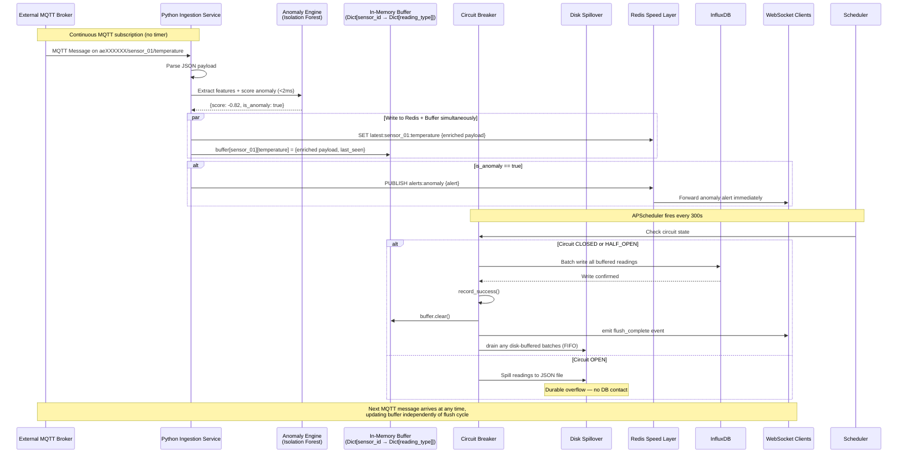

# IoT Telemetry Pipeline & Analytical Dashboard — Low-Level Design

**Version:** 1.0
**Date:** 2026-05-04
**Status:** Draft

---

## 1. MQTT Topic Naming Conventions & JSON Payload Schema

### 1.1 Topic Structure

```
aeXXXXXX/<sensor_id>/<reading_type>
```

| Segment | Description | Example |
|---------|-------------|---------|
| `aeXXXXXX` | Organization/project prefix (fixed) | `aeXXXXXX` |
| `<sensor_id>` | Unique sensor identifier | `sensor_01`, `temp_02` |
| `<reading_type>` | Type of measurement | `temperature`, `humidity`, `pressure`, `battery` |

**Examples:**
- `aeXXXXXX/sensor_01/temperature`
- `aeXXXXXX/sensor_02/humidity`
- `aeXXXXXX/sensor_03/battery`

### 1.2 Expected JSON Payload Schema

```json
{
  "sensor_id": "sensor_01",
  "timestamp": "2026-05-04T14:30:00.000Z",
  "reading_type": "temperature",
  "value": 23.7,
  "unit": "°C",
  "metadata": {
    "firmware_version": "1.2.3",
    "location": "zone-a"
  }
}
```

#### Field Definitions

| Field | Type | Required | Description |
|-------|------|----------|-------------|
| `sensor_id` | string | Yes | Unique sensor identifier; must match topic segment |
| `timestamp` | ISO 8601 string | Yes | UTC timestamp of when reading was taken at the sensor |
| `reading_type` | string | Yes | Measurement category (temperature, humidity, pressure, etc.) |
| `value` | float | Yes | The measured value |
| `unit` | string | Yes | Unit of measurement (°C, %, Pa, V, etc.) |
| `metadata` | object | No | Optional sensor metadata (firmware version, location, etc.) |

### 1.3 Payload Validation Rules

- `sensor_id`: 1–64 characters, alphanumeric + underscore
- `timestamp`: Must be a valid ISO 8601 UTC datetime; past timestamps up to 24 hours old are accepted; future timestamps are rejected (with a 30-second clock skew tolerance to account for minor sensor clock drift)
- `value`: Must be a finite float; `NaN` and `Infinity` are rejected
- `unit`: Non-empty string, max 16 characters

### 1.4 Enriched Payload Schema (Post Anomaly Detection)

After the anomaly engine processes a reading, the payload is enriched with:

```json
{
  "sensor_id": "sensor_01",
  "timestamp": "2026-05-04T14:30:00.000Z",
  "reading_type": "temperature",
  "value": 23.7,
  "unit": "°C",
  "metadata": {
    "firmware_version": "1.2.3",
    "location": "zone-a"
  },
  "anomaly": {
    "score": -0.82,
    "is_anomaly": true,
    "confidence": 0.91,
    "contributing_features": ["value_spike", "rate_of_change"],
    "model_version": "iforest_v1_2026-05-04"
  }
}
```

| Field | Type | Description |
|-------|------|-------------|
| `anomaly.score` | float | Raw Isolation Forest score. Range: -1 (anomaly) to +1 (normal) |
| `anomaly.is_anomaly` | bool | `true` if score < threshold (-0.5 default) |
| `anomaly.confidence` | float | Normalized confidence: `abs(score)` mapped to 0–1 |
| `anomaly.contributing_features` | string[] | Which extracted features drove the anomaly |
| `anomaly.model_version` | string | Model identifier for audit trail |

---

## 2. Time-Series Database Schema Design

### 2.1 Database: InfluxDB 2.7

**Organization:** `iot-project`
**Bucket:** `sensor-data`
**Retention Policy:** 30 days (configurable)

### 2.2 Measurement: `sensor_readings`

| Column | Type | Tag/Field | Description |
|--------|------|-----------|-------------|
| `sensor_id` | string | **Tag** | Sensor identifier (indexed for queries) |
| `reading_type` | string | **Tag** | Measurement type (indexed) |
| `timestamp` | datetime | **Timestamp** | When reading was taken (from sensor payload) |
| `processed_at` | datetime | **Field** | When reading was flushed to DB (server-side) |
| `value` | float | **Field** | Numeric measurement value |
| `unit` | string | **Field** | Unit of measurement |
| `location` | string | **Tag** (from metadata) | Sensor location |
| `firmware_version` | string | **Tag** (from metadata) | Sensor firmware version |
| `anomaly_score` | float | **Field** | Raw isolation forest score (-1 anomaly to +1 normal) |
| `is_anomaly` | bool | **Field** | Whether reading was flagged as anomalous |
| `anomaly_confidence` | float | **Field** | Normalized confidence 0–1 |

### 2.3 InfluxDB Line Protocol (for batch write)

```
sensor_readings,sensor_id=sensor_01,reading_type=temperature,location=zone-a,firmware_version=1.2.3 timestamp=1743778800000000000,processed_at=1743779100000000000,value=23.7,unit="°C"
```

**Timestamp precision:** Nanoseconds (InfluxDB default)
**Processed_at:** Unix nanoseconds at the moment of flush

### 2.4 Example Flux Queries

**Latest reading per sensor:**
```flux
from(bucket: "sensor-data")
  |> range(start: -1h)
  |> filter(fn: (r) => r["_measurement"] == "sensor_readings")
  |> last()
```

**Aggregate KPIs (min, max, avg) over last 24 hours per sensor:**
```flux
from(bucket: "sensor-data")
  |> range(start: -24h)
  |> filter(fn: (r) => r["_measurement"] == "sensor_readings")
  |> group(columns: ["sensor_id", "reading_type"])
  |> reduce(identity: {count: 0, sum: 0.0, min: 0.0, max: 0.0},
    fn: (r, accumulator) => ({
      count: accumulator.count + 1.0,
      sum: accumulator.sum + r.value,
      min: if accumulator.count == 0.0 then r.value else
           if r.value < accumulator.min then r.value else accumulator.min,
      max: if accumulator.count == 0.0 then r.value else
           if r.value > accumulator.max then r.value else accumulator.max
    })
  )
```

---

## 3. FastAPI REST & WebSocket Endpoint Contracts

### 3.1 Base URL

```
http://localhost:3000/api/v1
```

### 3.2 REST Endpoints

#### `GET /api/v1/sensors`
Returns list of all known sensor IDs.

**Response `200 OK`:**
```json
{
  "sensors": [
    {"sensor_id": "sensor_01", "reading_types": ["temperature", "humidity"]},
    {"sensor_id": "sensor_02", "reading_types": ["temperature", "pressure"]}
  ],
  "count": 2
}
```

---

#### `GET /api/v1/sensors/{sensor_id}/data`
Returns historical readings for a sensor within a time range.

**Path Parameters:**
| Parameter | Type | Description |
|-----------|------|-------------|
| `sensor_id` | string | The sensor identifier |

**Query Parameters:**
| Parameter | Type | Required | Default | Description |
|-----------|------|----------|---------|-------------|
| `start` | ISO 8601 datetime | No | `-24h` | Start of time range (inclusive) |
| `end` | ISO 8601 datetime | No | `now` | End of time range (inclusive) |
| `reading_type` | string | No | all | Filter by reading type |
| `interval` | string | No | `5m` | Downsample interval (e.g., `5m`, `1h`, `1d`) |
| `limit` | integer | No | `1000` | Max records returned (max 10000) |
| `offset` | integer | No | `0` | Pagination offset |

**Response `200 OK`:**
```json
{
  "sensor_id": "sensor_01",
  "reading_type": "temperature",
  "data": [
    {
      "timestamp": "2026-05-04T12:00:00.000Z",
      "processed_at": "2026-05-04T12:05:00.000Z",
      "value": 22.3,
      "unit": "°C"
    },
    {
      "timestamp": "2026-05-04T12:05:00.000Z",
      "processed_at": "2026-05-04T12:10:00.000Z",
      "value": 22.7,
      "unit": "°C"
    }
  ],
  "total": 2,
  "limit": 1000,
  "offset": 0
}
```

**Response `404 Not Found`:**
```json
{
  "detail": "Sensor sensor_99 not found"
}
```

---

#### `GET /api/v1/sensors/{sensor_id}/latest`
Returns the most recent reading for a sensor. Fetched directly from Redis for sub-second response times.

**Logic:** Queries `redis_client.get(f"latest:{sensor_id}:{reading_type}")`. Falls back to InfluxDB if the key is not found in Redis.

**Response `200 OK`:**
```json
{
  "sensor_id": "sensor_01",
  "reading_type": "temperature",
  "timestamp": "2026-05-04T14:30:00.000Z",
  "processed_at": "2026-05-04T14:35:00.000Z",
  "value": 23.7,
  "unit": "°C",
  "data_age_seconds": 3
}
```

> **`data_age_seconds`**: Integer. Seconds between the sensor's `timestamp` and the current server time. Since this value is read directly from the Redis speed layer (written on every MQTT message), this reflects the true age of the data — typically just a few seconds, not the full 5-minute batch interval.

---

#### `GET /api/v1/kpis`
Returns aggregate KPIs (min, max, avg, count) per sensor over a configurable window.

**Query Parameters:**
| Parameter | Type | Required | Default | Description |
|-----------|------|----------|---------|-------------|
| `window` | string | No | `1h` | Time window (e.g., `1h`, `6h`, `24h`, `7d`) |
| `reading_type` | string | No | all | Filter by reading type |

**Response `200 OK`:**
```json
{
  "window": "24h",
  "kpis": [
    {
      "sensor_id": "sensor_01",
      "reading_type": "temperature",
      "min": 18.2,
      "max": 27.3,
      "avg": 22.6,
      "count": 288,
      "unit": "°C"
    }
  ]
}
```

---

#### `GET /health`
Health check endpoint for the ingestion and API services.

**Ingestion service response (`GET http://ingestion:8001/health`):**
```json
{
  "status": "ok",
  "buffer_size": 10,
  "last_flush_at": "2026-05-04T14:35:00.000Z",
  "next_flush_at": "2026-05-04T14:40:00.000Z",
  "mqtt_connected": true,
  "subscribed_topic": "aeXXXXXX/#",
  "circuit_breaker": {
    "circuit_breaker": "influxdb",
    "state": "closed",
    "failure_count": 0,
    "success_count": 1440,
    "total_rejected": 0
  },
  "disk_buffer_files": 0
}
```

**API service response (`GET http://api:8000/health`):**
```json
{
  "status": "ok",
  "influxdb_connected": true,
  "timestamp": "2026-05-04T14:36:00.000Z"
}
```

---

### 3.3 WebSocket Endpoint

#### `WS /ws/live`

Pushes the latest sensor readings to connected clients after each database flush (every 5 minutes).

**Connection:** `ws://localhost:3000/ws/live`

**Server -> Client Message (JSON):**
```json
{
  "event": "flush_complete",
  "timestamp": "2026-05-04T14:40:00.000Z",
  "readings": [
    {
      "sensor_id": "sensor_01",
      "reading_type": "temperature",
      "timestamp": "2026-05-04T14:35:00.000Z",
      "processed_at": "2026-05-04T14:40:00.000Z",
      "value": 23.7,
      "unit": "°C"
    },
    {
      "sensor_id": "sensor_02",
      "reading_type": "humidity",
      "timestamp": "2026-05-04T14:35:00.000Z",
      "processed_at": "2026-05-04T14:40:00.000Z",
      "value": 58.1,
      "unit": "%"
    }
  ]
}
```

**Client -> Server (Ping/Pong for keepalive):**
```json
{ "type": "ping" }
```

**Server -> Client (Pong):**
```json
{ "type": "pong" }
```

**Connection lifecycle:**
- On successful WebSocket handshake, server sends `{ "event": "connected", "timestamp": "..." }`
- Server sends flush messages every 5 minutes (or on error condition)
- Client should handle reconnection on disconnect
- Ping/pong keepalive every 30 seconds

---

#### `GET /api/v1/anomalies`
Returns recent anomaly events detected by the inline ML engine.

**Query Parameters:**
| Parameter | Type | Default | Description |
|-----------|------|---------|-------------|
| `since` | ISO 8601 | `-1h` | Time window |
| `sensor_id` | string | all | Filter by sensor |
| `min_confidence` | float | `0.5` | Minimum confidence threshold |

**Response `200 OK`:**
```json
{
  "anomalies": [
    {
      "sensor_id": "sensor_01",
      "reading_type": "temperature",
      "value": 47.2,
      "timestamp": "2026-05-04T14:30:00.000Z",
      "anomaly": {
        "score": -0.82,
        "is_anomaly": true,
        "confidence": 0.91,
        "contributing_features": ["value_spike"]
      }
    }
  ],
  "count": 1
}
```

---

## 4. Python Processor — Buffer and Flush Sequence Diagram



### 4.1 Key Implementation Details

**Ingestion Service Main Loop (pseudocode):**
```python
import paho.mqtt.client as mqtt
from apscheduler.schedulers.background import BackgroundScheduler
import redis
import json
import time
import os
from pathlib import Path
from enum import Enum
from threading import Lock
from dataclasses import dataclass, field

# ─────────────────────────────────────────────
# OpenTelemetry Tracing Setup
# ─────────────────────────────────────────────
from opentelemetry import trace, context
from opentelemetry.sdk.trace import TracerProvider
from opentelemetry.sdk.trace.export import BatchSpanProcessor
from opentelemetry.exporter.otlp.proto.grpc.trace_exporter import OTLPSpanExporter
from opentelemetry.sdk.resources import Resource, SERVICE_NAME
from opentelemetry.trace import SpanKind, StatusCode

_tracer = None

def init_telemetry(service_name: str):
    global _tracer
    resource = Resource(attributes={SERVICE_NAME: service_name})
    provider = TracerProvider(resource=resource)
    exporter = OTLPSpanExporter(
        endpoint=os.getenv("OTEL_EXPORTER_ENDPOINT", "http://otel-collector:4317"),
        insecure=True
    )
    provider.add_span_processor(BatchSpanProcessor(exporter))
    trace.set_tracer_provider(provider)
    _tracer = trace.get_tracer(service_name)

init_telemetry("iot-ingestion-service")

# ─────────────────────────────────────────────
# Circuit Breaker (resilience/circuit_breaker.py)
# ─────────────────────────────────────────────
class CircuitState(Enum):
    CLOSED = "closed"
    OPEN = "open"
    HALF_OPEN = "half_open"

@dataclass
class CircuitBreaker:
    name: str
    failure_threshold: int = 5
    recovery_timeout: float = 60.0
    _state: CircuitState = field(default=CircuitState.CLOSED, init=False)
    _failure_count: int = field(default=0, init=False)
    _last_failure_time: float = field(default=0.0, init=False)
    _success_count: int = field(default=0, init=False)
    _total_rejected: int = field(default=0, init=False)
    _lock: Lock = field(default_factory=Lock, init=False)

    @property
    def state(self) -> CircuitState:
        with self._lock:
            if self._state == CircuitState.OPEN:
                if time.time() - self._last_failure_time >= self.recovery_timeout:
                    self._state = CircuitState.HALF_OPEN
            return self._state

    def can_execute(self) -> bool:
        current = self.state
        if current in (CircuitState.CLOSED, CircuitState.HALF_OPEN):
            return True
        self._total_rejected += 1
        return False

    def record_success(self):
        with self._lock:
            self._state = CircuitState.CLOSED
            self._failure_count = 0
            self._success_count += 1

    def record_failure(self):
        with self._lock:
            self._failure_count += 1
            self._last_failure_time = time.time()
            if self._state == CircuitState.HALF_OPEN:
                self._state = CircuitState.OPEN
            elif self._failure_count >= self.failure_threshold:
                self._state = CircuitState.OPEN

    def get_metrics(self) -> dict:
        return {
            "circuit_breaker": self.name,
            "state": self.state.value,
            "failure_count": self._failure_count,
            "success_count": self._success_count,
            "total_rejected": self._total_rejected,
        }

influx_breaker = CircuitBreaker(
    name="influxdb",
    failure_threshold=int(os.getenv("CB_FAILURE_THRESHOLD", "5")),
    recovery_timeout=float(os.getenv("CB_RECOVERY_TIMEOUT", "60")),
)

# ─────────────────────────────────────────────
# Anomaly Detection (anomaly/scorer.py)
# ─────────────────────────────────────────────
class AnomalyScorer:
    def __init__(self, model_path: str, threshold: float = -0.5):
        self.threshold = threshold
        self.model = None
        self.model_version = "none"
        self._load_model(model_path)

    def _load_model(self, path: str):
        import joblib
        p = Path(path)
        if p.exists():
            self.model = joblib.load(p)
            self.model_version = p.stem
            log_info(f"Loaded anomaly model: {self.model_version}")
        else:
            log_warning(f"No model at {path} — anomaly detection disabled")

    def score(self, features) -> dict:
        import numpy as np
        if self.model is None:
            return {"score": 0.0, "is_anomaly": False, "confidence": 0.0,
                    "contributing_features": [], "model_version": "disabled"}
        try:
            raw_score = float(self.model.decision_function(features.reshape(1, -1))[0])
            is_anomaly = raw_score < self.threshold
            confidence = min(abs(raw_score) / abs(self.threshold), 1.0)
            contributing = []
            if len(features) >= 4 and abs(features[3]) > 0.5:
                contributing.append("rate_of_change")
            return {
                "score": round(raw_score, 4),
                "is_anomaly": is_anomaly,
                "confidence": round(confidence, 4),
                "contributing_features": contributing,
                "model_version": self.model_version,
            }
        except Exception as e:
            log_error(f"Anomaly scoring failed: {e}")
            return {"score": 0.0, "is_anomaly": False, "confidence": 0.0,
                    "contributing_features": [], "model_version": "error"}

anomaly_scorer = AnomalyScorer(
    model_path=os.getenv("ANOMALY_MODEL_PATH", "/models/iforest.joblib"),
    threshold=float(os.getenv("ANOMALY_THRESHOLD", "-0.5"))
)

# Feature extractor: sliding window per (sensor_id, reading_type)
from collections import deque
import numpy as np

class SensorFeatureExtractor:
    def __init__(self, window_size: int = 20):
        self.windows: dict[tuple, deque] = {}
        self.window_size = window_size

    def extract(self, sensor_id: str, reading_type: str, value: float) -> np.ndarray:
        key = (sensor_id, reading_type)
        if key not in self.windows:
            self.windows[key] = deque(maxlen=self.window_size)
        w = self.windows[key]
        w.append(value)
        vals = np.array(w)
        if len(vals) < 3:
            return np.zeros(6)
        return np.array([
            value,
            np.mean(vals),
            np.std(vals),
            value - vals[-2] if len(vals) > 1 else 0,
            value - np.min(vals),
            np.max(vals) - value,
        ])

feature_extractor = SensorFeatureExtractor(window_size=20)

# ─────────────────────────────────────────────
# Buffer + State
# ─────────────────────────────────────────────
buffer: dict[str, dict[str, dict]] = {}
failed_batches: list[dict] = []

MAX_BUFFER_SIZE = 10000
STALE_THRESHOLD_SECONDS = 600
DISK_BUFFER_DIR = Path(os.getenv("DISK_BUFFER_DIR", "/data/buffer"))
DISK_BUFFER_DIR.mkdir(parents=True, exist_ok=True)

redis_client = redis.Redis.from_url("redis://redis:6379", decode_responses=True)
scheduler = BackgroundScheduler()

# ─────────────────────────────────────────────
# MQTT Message Handler (with OTel + ML + Redis)
# ─────────────────────────────────────────────
def on_mqtt_message(client, userdata, msg):
    with _tracer.start_as_current_span(
        "mqtt_message_received",
        kind=SpanKind.CONSUMER,
        attributes={"mqtt.topic": msg.topic}
    ) as span:
        payload = json.loads(msg.payload)
        sensor_id = payload["sensor_id"]
        reading_type = payload.get("reading_type", "default")
        value = payload["value"]

        span.set_attribute("sensor.id", sensor_id)
        span.set_attribute("sensor.reading_type", reading_type)
        span.set_attribute("sensor.value", value)

        # — Anomaly scoring (traced) —
        with _tracer.start_as_current_span("anomaly_scoring") as ai_span:
            features = feature_extractor.extract(sensor_id, reading_type, value)
            anomaly_result = anomaly_scorer.score(features)
            payload["anomaly"] = anomaly_result
            ai_span.set_attribute("anomaly.score", anomaly_result["score"])
            ai_span.set_attribute("anomaly.is_anomaly", anomaly_result["is_anomaly"])

        # — Buffer insert —
        with _tracer.start_as_current_span("buffer_insert") as buf_span:
            if sensor_id not in buffer:
                buffer[sensor_id] = {}
            if len(buffer[sensor_id]) >= MAX_BUFFER_SIZE:
                log_warning(f"Buffer full for sensor {sensor_id}")
            else:
                buffer[sensor_id][reading_type] = {
                    "payload": payload,
                    "last_seen": time.time()
                }
            buf_span.set_attribute("buffer.total_sensors", len(buffer))

        # — Redis speed layer write (auto-instrumented) —
        with _tracer.start_as_current_span("redis_speed_layer_write"):
            redis_key = f"latest:{sensor_id}:{reading_type}"
            redis_client.set(redis_key, json.dumps(payload))

        # — Anomaly alert via Redis pub/sub —
        if anomaly_result["is_anomaly"]:
            alert = {
                "event": "anomaly_detected",
                "sensor_id": sensor_id,
                "reading_type": reading_type,
                "value": value,
                "anomaly": anomaly_result,
                "timestamp": payload["timestamp"]
            }
            redis_client.publish("alerts:anomaly", json.dumps(alert))

# ─────────────────────────────────────────────
# Flush Handler (with Circuit Breaker + Disk Spillover)
# ─────────────────────────────────────────────
def _spill_to_disk(readings: list):
    filename = DISK_BUFFER_DIR / f"batch_{int(time.time())}.json"
    with open(filename, "w") as f:
        json.dump(readings, f)
    log_info(f"Spilled {len(readings)} readings to {filename}")

def _drain_disk_buffer():
    files = sorted(DISK_BUFFER_DIR.glob("batch_*.json"))
    for f in files:
        try:
            with open(f) as fh:
                readings = json.load(fh)
            write_to_influxdb(readings)
            f.unlink()
            log_info(f"Drained disk batch {f.name}")
        except Exception as e:
            log_error(f"Disk drain failed on {f.name}: {e}")
            break

def flush_buffer():
    with _tracer.start_as_current_span(
        "influx_batch_flush",
        kind=SpanKind.CLIENT,
        attributes={"circuit_breaker.state": influx_breaker.state.value}
    ) as span:
        now = time.time()

        # 1. Evict stale entries
        stale_sensors = [
            sid for sid, entries in buffer.items()
            if all(now - e["last_seen"] > STALE_THRESHOLD_SECONDS for e in entries.values())
        ]
        for sid in stale_sensors:
            buffer.pop(sid, None)

        if not buffer:
            return

        flat_readings = [
            entry["payload"]
            for entries in buffer.values()
            for entry in entries.values()
        ]

        # 2. Circuit Breaker gate
        if influx_breaker.can_execute():
            try:
                with _tracer.start_as_current_span("influx_batch_write") as db_span:
                    write_to_influxdb(flat_readings)
                    db_span.set_attribute("batch.size", len(flat_readings))

                influx_breaker.record_success()
                buffer.clear()

                with _tracer.start_as_current_span("ws_broadcast") as ws_span:
                    broadcast_via_websocket(flat_readings)
                    ws_span.set_attribute("ws.connected_clients", len(ws_connections))

                # 3. Drain disk buffer on success
                _drain_disk_buffer()

            except Exception as e:
                span.set_status(StatusCode.ERROR, str(e))
                span.record_exception(e)
                influx_breaker.record_failure()
                _spill_to_disk(flat_readings)
                ws_emit("flush_error", {
                    "error": str(e),
                    "circuit_state": influx_breaker.state.value
                })
        else:
            # Circuit OPEN — skip DB, spill to disk
            log_warning(f"Circuit OPEN — buffering {len(flat_readings)} to disk")
            _spill_to_disk(flat_readings)

scheduler.add_job(flush_buffer, "interval", seconds=300)
client.on_message = on_mqtt_message
client.subscribe("aeXXXXXX/#")
client.loop_start()
scheduler.start()
```

---

## 5. Frontend Component Structure — Analytical Dashboard

### 5.1 Component Hierarchy

```
<App>
├── <DashboardLayout>
│   ├── <Header />         # App title, connection status, time
│   ├── <KPIRibbon />      # Horizontal scrolling KPI cards
│   ├── <ChartView />      # Time-series chart with controls
│   └── <TimeRangeSelector />  # 1h / 6h / 24h / 7d buttons
```

### 5.2 Component Details

#### `<KPIRibbon />`
Horizontal scrolling strip at the top of the dashboard.

**Props:** `kpis: KPIData[]` (from `/api/v1/kpis`)

**Layout:** Flexbox row with horizontal scroll, gap-4 spacing.

**Per-Card Design:**
```
┌─────────────────────────────────┐
│  sensor_01 · temperature       │
│  ━━━━━━━━━━━━━━━━━━━━━━━━━━━━━  │
│  23.7 °C           ▲ +0.3      │
│  min: 18.2  max: 27.3          │
│  Last updated: 14:40            │
└─────────────────────────────────┘
```

- **Value:** Large font, primary color
- **Trend arrow:** Green (▲ up), Red (▼ down), Gray (— flat) based on delta from previous reading
- **Min/Max:** Small secondary text
- **Timestamp:** Relative time ("2 min ago") or absolute ("14:40")

**Color coding:**
- Normal: Blue/gray border
- Warning (value > 90th percentile): Yellow border
- Critical (value > 98th percentile): Red border

#### `<ChartView />`
Time-series line chart below the KPI ribbon.

**Props:** `sensorId: string, readingType: string, timeRange: TimeRange`

**Features:**
- X-axis: Time (auto-scaled to time range)
- Y-axis: Value with unit label
- Multi-sensor overlay mode: toggle up to 3 sensors on same chart
- Hover tooltip: shows exact value and timestamp
- Chart library: **Recharts** (React-native, lightweight)

**States:**
- Loading: Skeleton placeholder
- Error: Error message with retry button
- Empty: "No data for selected range" message

#### `<TimeRangeSelector />`
Button group for selecting the time window.

**Options:** `1h`, `6h`, `24h`, `7d`

**Behavior:** Selecting a range triggers a re-fetch of `/api/v1/sensors/{id}/data` and re-renders the chart.

#### `<ConnectionStatus />`
Small indicator in the header showing WebSocket connection state.

**States:**
- Connected (green dot): WebSocket active, receiving live data
- Reconnecting (yellow dot): Connection lost, auto-retry in progress
- Disconnected (red dot): Manual reconnect button shown

### 5.3 API Integration

**Custom Hooks (React):**

```typescript
// useSensorData.ts
function useSensorData(sensorId: string, timeRange: TimeRange) {
  // fetches GET /api/v1/sensors/{sensorId}/data?start=&end=
  // returns { data, isLoading, error }
}

// useKPIs.ts
function useKPIs(window: TimeWindow) {
  // fetches GET /api/v1/kpis?window=
  // returns { kpis, isLoading, error }
}

// useWebSocket.ts
function useWebSocket(url: string) {
  // manages WebSocket connection lifecycle
  // returns { lastMessage, connectionStatus, reconnect }
}
```

### 5.4 State Management

- **No external state library** (Redux/Zustand) needed for this scope
- React Context for global state: `SensorContext` (list of sensors, selected sensor)
- Local component state for UI concerns (chart zoom, modal open/close)
- `useReducer` for complex `ChartView` state if needed

### 5.5 Key Files Structure

```
frontend/
├── src/
│   ├── components/
│   │   ├── DashboardLayout.tsx
│   │   ├── Header.tsx
│   │   ├── KPIRibbon.tsx
│   │   ├── KPICard.tsx
│   │   ├── ChartView.tsx
│   │   ├── TimeRangeSelector.tsx
│   │   └── ConnectionStatus.tsx
│   ├── hooks/
│   │   ├── useSensorData.ts
│   │   ├── useKPIs.ts
│   │   └── useWebSocket.ts
│   ├── context/
│   │   └── SensorContext.tsx
│   ├── api/
│   │   └── client.ts           # axios or fetch wrapper
│   ├── types/
│   │   └── sensor.ts           # TypeScript interfaces
│   ├── App.tsx
│   └── main.tsx
├── tailwind.config.js
├── vite.config.ts
└── package.json
```

---

## 6. Error Handling & Edge Cases

| Scenario | Handling |
|----------|----------|
| MQTT broker unreachable at startup | Retry with exponential backoff (max 5 retries), then exit with error + health check reflects `mqtt_connected: false` |
| JSON parse failure on MQTT message | Log warning, skip message, do not crash |
| Invalid sensor_id in message | Validate against expected pattern, reject if malformed |
| InfluxDB write failure | Retain buffer, retry on next flush cycle; emit `flush_error` via WebSocket |
| WebSocket client disconnects | Server cleans up connection; client auto-reconnects with backoff |
| API request for unknown sensor | Return `404` with descriptive message |
| Empty buffer on flush trigger | Skip write (no-op), log "nothing to flush" |
| Sensor stops publishing | Buffer holds last known value; after 2 missed flush cycles (10 min), health check alerts via `stale: true` flag |